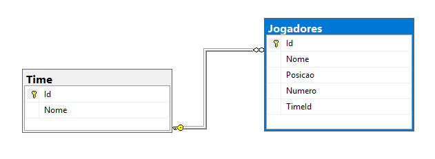

# Painel de Times usando C# e SQL Server

<h4>Aplicação WPF usando C# que se conecta de forma assíncrona com um banco de dados SQL.</h4>

<hr>

<p>Esse projeto é um exemplo que utilizei para entender melhor como trazer dados de um banco de dados para uma aplicação real em dispositivos Windows. Para estruturação do projeto, usei MVVM (Model-View-ViewModel).</p>

## Objetivo do projeto

<p>Demonstrar como:</p>

  - Conectar uma aplicação WPF a um banco de dados SQL Server
  - Implementar o padrão MVVM em um projeto real
  - Trabalhar com a abordagem Database First
  - Exibir dados relacionais (Times -> Jogadores) em interface gráfica

## Arquitetura do Projeto

<p>O projeto segue a metodologia Database First, onde criei primeiramente a estrutura do banco relacional pelo SQL Server Management (para acessar o script de criação, acesse Scrips -> Sql_createTables.sql). A estrutura de pastas ficou assim: </p>

```
GerenciadorDeTorneios/
├── Models/                    # Entidades do domínio
│   ├── Time.cs               # Classe Time com propriedades e lista de jogadores
│   └── Jogadores.cs          # Classe Jogador com propriedades básicas
│
├── Data/                     # Camada de acesso a dados
│   ├── TimeRepository.cs     # Operações CRUD para Time
│   └── JogadoresRepository.cs # Operações CRUD para Jogadores
│
├── ViewModel/                # Camada de lógica de apresentação
│   └── MainWindowViewModel.cs # ViewModel principal com binding e commands
│
├── Views/                    # Interface do usuário
│   └── MainWindow.xaml      # Tela principal com listagem de times e jogadores
│
├── App.xaml                  # Ponto de entrada da aplicação
└── App.config               # Configurações (connection string)
```
## Banco de Dados

<p>No banco de dados existem apenas duas tabelas: Time e Jogadores, relacionadas em 1:N (um time pode ter vários jogadores). Essas tabelas são conectadas por uma chave estrangeira, onde Jogadores.TimeId referencia Time.Id:</p>



### Conexão com Banco de Dados

<p>A configuração de conexão está no App.config, onde criei um tipo connectionStrings, adicionando as seguintes informações:</p>

  - name -> nome do banco de dados no projeto 
  - connectionString -> contendo o nome do Servidor do banco de dados, o nome do banco no SQL Server e Trusted_Connection = True, permitindo a conexão sem certificado SSL
  - providerName -> System.Data.SqlClient (específico para banco de dados SQL Server em C#)

### Padrão Repository

<p>Cada entidade possui um repositório no projeto (pasta /Data) responsável por abrir/fechar conexões, executar comandos SQL e mapear resultados para objetos em C#.</p>

## MVVM (Model-View-ViewModel)

<p>Model</p>

  - Time.cs e Jogadores.cs: classes com propriedades
  - Representam as entidades do banco de dados

<p>ViewModel</p>

  - MainWindowViewModel.cs: centraliza a lógica de apresentação
  - Implementa INotifyPropertyChanged para notificar mudanças à View
  - Gerencia ObservableCollection<T> para binding automático
  - Coordena a comunicação entre View e Repositórios

<p>View</p>

  - MainWindow.xaml: interface gráfica com XAML
  - Utiliza Data Binding para conectar-se ao ViewModel
  - Template dos dados para exibir times e jogadores


  
